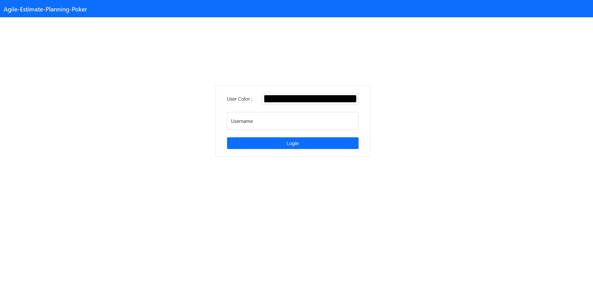
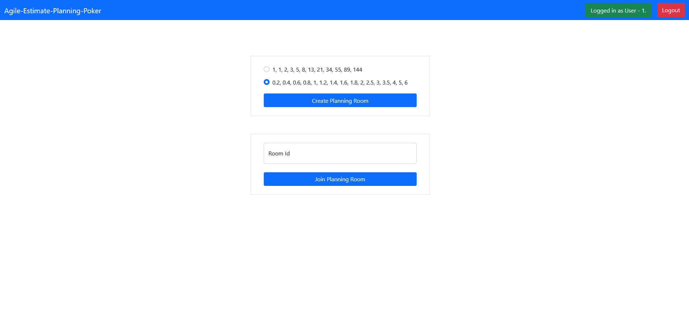
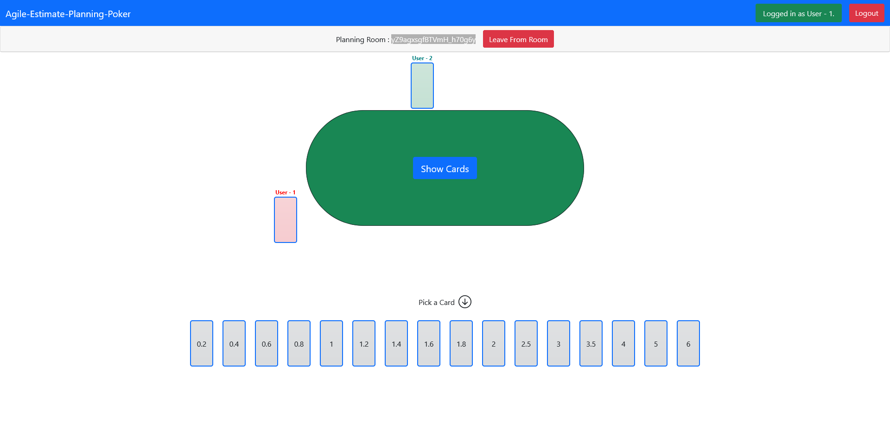
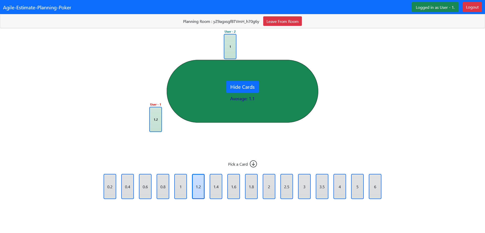

#  agile-estimate-planning-poker
Planning poker for estimate issues

---

## Server

#### `npm start`

Runs the app in the development mode.\
Backend code will run on http://localhost:3001. You should connect this from client app.

---

## Client

#### `npm start`

Runs the app in the development mode.\
Open [http://localhost:3000](http://localhost:3000) to view it in the browser.

The page will reload if you make edits.
You will also see any lint errors in the console.

---

### Images

   
  

   
  

